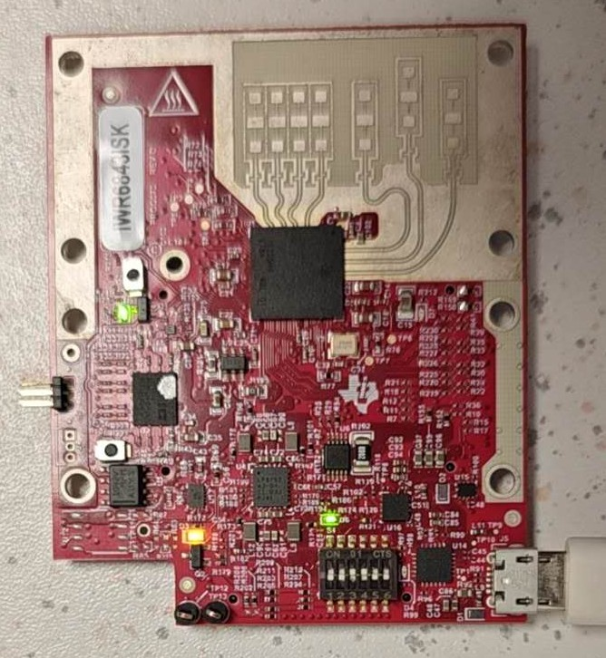
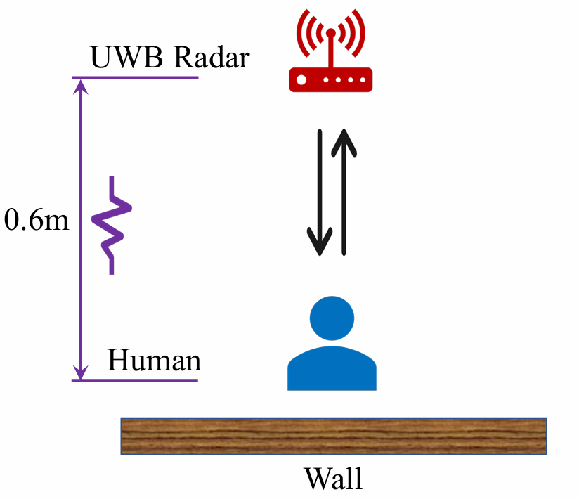
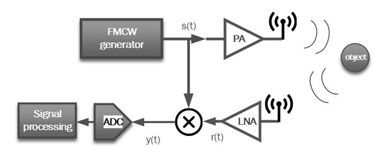
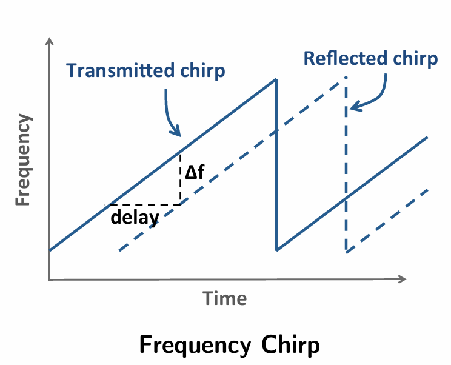
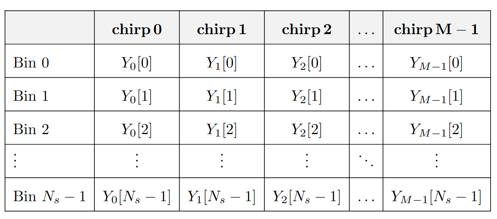
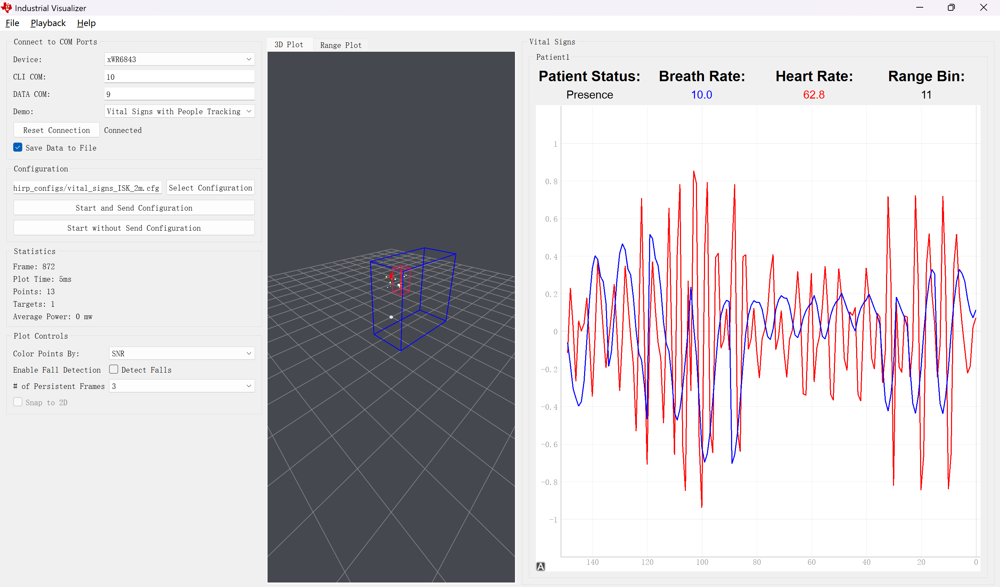
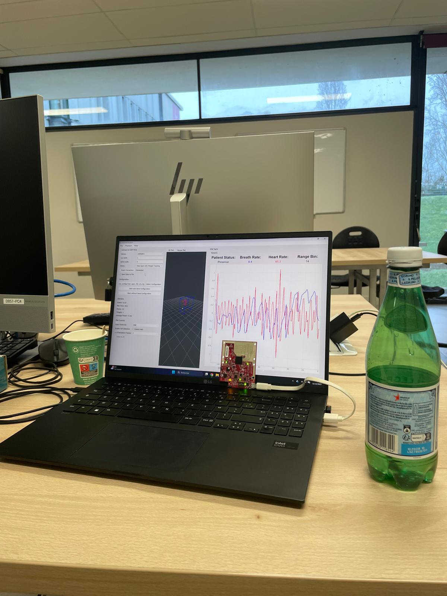

# Remote Vital Sign Detection via 77GHz FMCW Radar
**Independent Research | Digital Health | Signal Processing Implementation**

---

  <table border="0" style="border-collapse: collapse; border: none; width: 100%;">
    <tr style="border: none;">
      <td align="left" style="border: none; width: 70%; vertical-align: middle;">
        

          <b>Project Period:</b> Oct 2025 – Jan 2026  
          <b>Institution:</b> École Nationale Supérieure de l'Électronique et de ses Applications (ENSEA), France  
          <b>Supervisor:</b> Prof. Chen  
          <b>Focus:</b> 77GHz mmWave Signal Processing & Digital Health Implementation
        

      </td>
      <td align="right" style="border: none; width: 30%; vertical-align: middle;">
        
      </td>
    </tr>
  </table>

---

## 1. Research Motivation & Background
Traditional health monitoring (ECG, PPG) relies on contact sensors, which are impractical for long-term sleep monitoring or isolated clinical environments. This project validates the use of **77GHz mm-wave FMCW Radar** for non-contact Heart Rate (HR) and Breathing Rate (BR) detection.

  <table border="0" style="border-collapse: collapse; border: none; width: 90%;">
    <tr style="border: none;">
      <td align="center" style="border: none; width: 45%;">
        
        
<b>(a) 77GHz mmWave Radar (IWR6843ISK)</b>

      </td>
      <td align="center" style="border: none; width: 55%;">
        
        
<b>(b) Experimental Setup Scenario</b>

      </td>
    </tr>
  </table>
  
<b>Figure 1: Hardware Platform and Test Scenario. (a) The compact IWR6843ISK SoC used for precise phase acquisition. (b) The actual placement of the radar for vital sign monitoring.</b>

---

## 2. Mathematical Foundation: The Physics of FMCW
The system transmits a linear chirp signal and mixes the reflected signal to produce the **Beat Signal** (IF signal).

  
  
<b>Figure 2: System Architecture of FMCW Radar showing Mixing and IF Signal Generation</b>

### 2.1 The Derivation of Beat Signal $y(t)$
Transmitted signal: $s(t) = A_t e^{j(2\pi f_{min}t + \pi K t^2)}$
Reflected signal delay: $t_d = 2R(t)/c$

Through mixing and conjugation ($s_{tx}(t) \times s^*_{rx}(t)$):
$$\begin{aligned}
y(t) & \approx A_tA_re^{j(2\pi f_{min}t_d+2\pi Ktt_d-\pi Kt_d^2)} \\
& \approx A_tA_re^{j(\underbrace{\frac{4\pi(R_0+x(t))}{\lambda_{\max}}}_{\text{Slow Phase } \psi(t)} + \underbrace{\frac{4\pi KR_0t}{c}}_{\text{Beat Frequency } \omega_b t})}
\end{aligned}$$

**Key Engineering Approximation:**
The modulation term $\frac{4\pi Kx(t)t}{c}$ is ignored because for a $0.1mm$ displacement, the phase change within a single chirp is $\approx 0.018 \text{ rad} (\approx 1^\circ)$, which is negligible compared to the target's absolute range phase.

  
  
<b>Figure 3: Linear Frequency Modulation (Chirp) and the corresponding IF Signal Generation</b>

---

## 3. Why 77GHz? (The TEL Perspective)
The choice of 77GHz is the cornerstone of high-precision detection:
1. **High Sensitivity**: $\lambda_{max} \approx 3.9$ mm. Since $\Delta\psi = \frac{4\pi \Delta x(t)}{\lambda}$, a smaller $\lambda$ results in a larger phase change for the same displacement $x(t)$.
2. **Range Resolution**: FMCW allows us to distinguish the human body from static clutter (walls, bed) via **Range-FFT**.
3. **Noise Immunity**: Phase modulation is inherently more robust against thermal noise compared to amplitude modulation.

---

## 4. Signal Processing Chain: 2D-FFT
To extract HR/BR, we separate **Fast-time** (within a chirp) and **Slow-time** (across multiple chirps).

### 4.1 Range-FFT (Fast-time)
We perform an $N_s$-point FFT on each chirp to identify the **Range Bin** corresponding to the subject's position $R_0$:
$$f_b = \frac{2 K R_0}{c}$$

### 4.2 Phase Extraction & Vibration-FFT (Slow-time)
We extract the phase sequence $\phi[n]$ from the specific target bin across $M$ chirps:
$$\phi[n] = \arg\{Z[n]\} \approx \frac{4 \pi}{\lambda} (R_0 + x[n])$$

  
  
<b>Figure 4: 2D Signal Processing Matrix. Each column represents a Range-FFT (Fast-time), and each row tracks phase changes across Chirps (Slow-time).</b>

---

## 5. Advanced Algorithms & Optimization
The research focuses on three critical processing steps to ensure accuracy:
- **Phase Unwrapping**: Resolving the $2\pi$ ambiguity in tracking chest movement.
- **DC Compensation**: Removing static clutter that shifts the phase constellation.
- **De-trending**: Filtering out low-frequency drift to isolate the heart rate signal (0.8–2.0 Hz).

  
  
<b>Figure 5: Final Experimental Results. The processed radar phase signal (Blue) shows high correlation with the Hexoskin reference sensor (Red) in both Breathing Rate (BR) and Heart Rate (HR) extraction.</b>

---

## 6. Conclusion
By tracking the "Slow Phase" $\psi(t)$, the system achieves sub-millimeter precision. The 77GHz radar's phase sensitivity ($\approx 3221 \text{ rad/m}$) makes it an ideal candidate for next-generation Digital Health monitoring.

  
  
<i>Figure 6: A snapshot of the experimental environment.</i>

