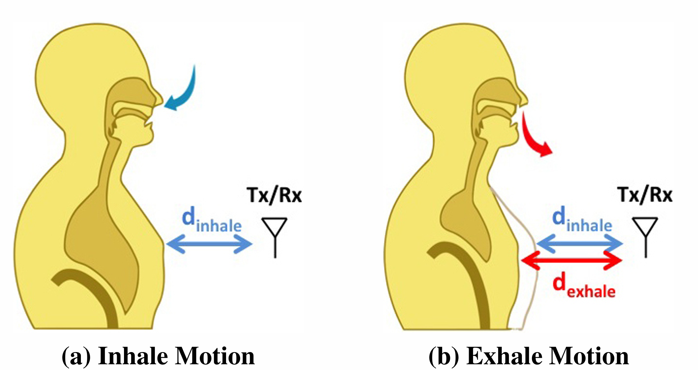
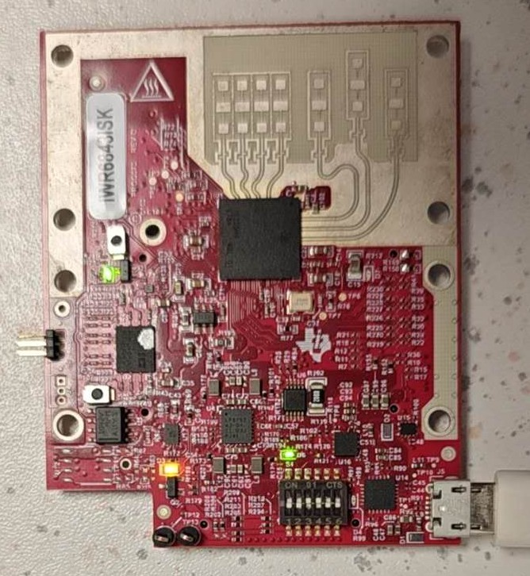
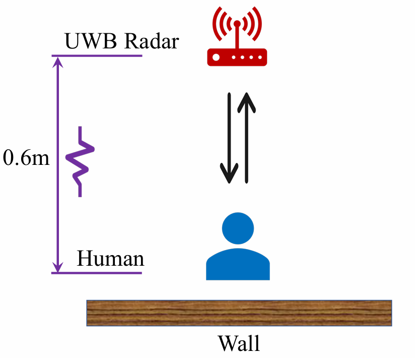
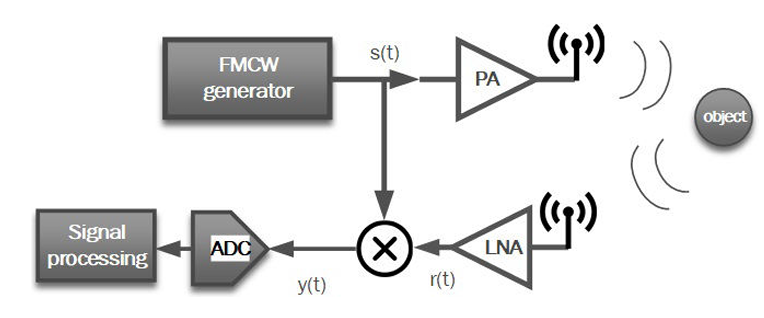
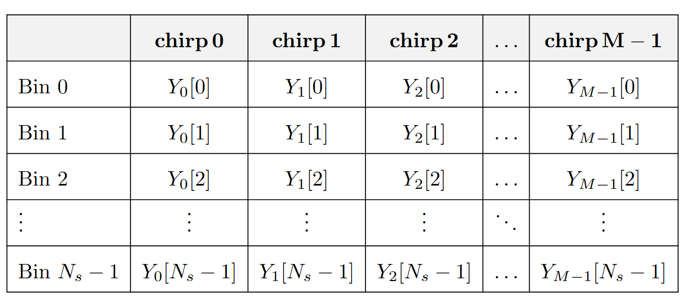
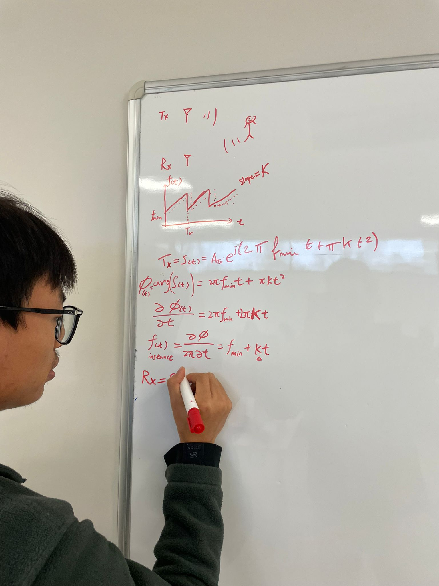
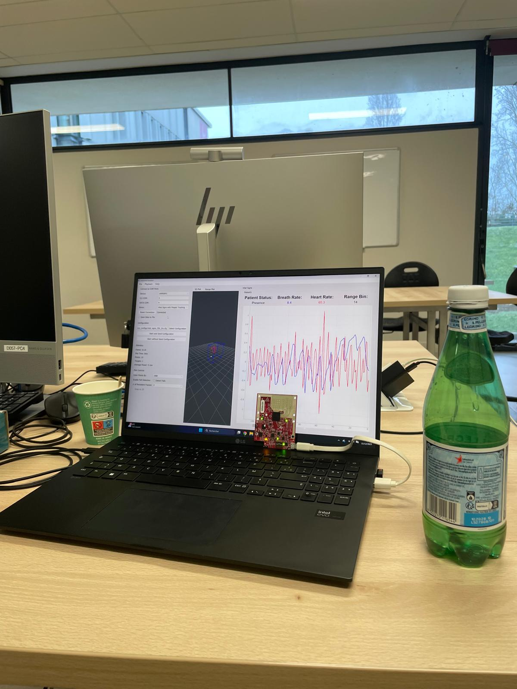
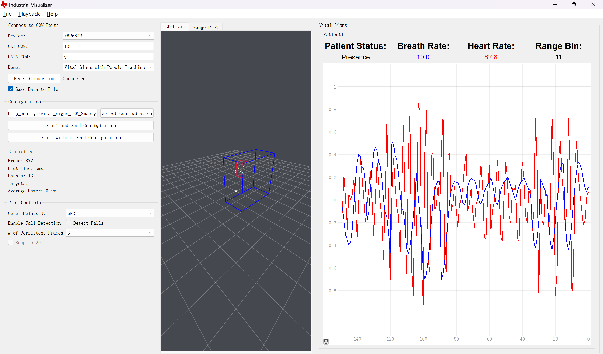

---
---

<section class="project-hero">
  <h1>Contactless Vital-Sign Detection with 60 GHz FMCW Radar</h1>
  
From raw radar samples to breathing- and heart-rate estimation through range selection and phase-based micro-motion analysis.

  

    
<strong>Project period</strong>October 2025 – January 2026

    
<strong>Institution</strong>ENSEA, France

    
<strong>Supervisor</strong><a href="https://www.etis-lab.fr/2023/01/11/chen-luan/" target="_blank" rel="noopener noreferrer">Dr. Luan Chen</a>

    
<strong>Platform</strong>TI IWR6843ISK, 60–64 GHz

  

</section>

## Project at a glance

This project investigates how a frequency-modulated continuous-wave (FMCW) radar can recover the small chest displacements caused by breathing and cardiac activity without attaching a sensor to the subject. The work combines radar configuration, data acquisition, range-domain processing, phase extraction, and spectral estimation.

  

    <h3>Research question</h3>
    
Can a 60 GHz FMCW radar isolate a subject in range and track sub-millimetre chest motion well enough to estimate respiratory and cardiac periodicity?

  

  

    <h3>What we implemented</h3>
    
A processing workflow built around range FFT, target-bin selection, phase unwrapping, static/DC compensation, detrending, filtering, and slow-time spectral analysis.

  

<figure class="project-figure">
  
  <figcaption><strong>Figure 1.</strong> Contactless sensing principle: inhalation and exhalation change the radar-to-chest distance, producing a measurable phase variation in the reflected signal.</figcaption>
</figure>

## Experimental platform and workflow

The setup used a Texas Instruments IWR6843ISK mmWave evaluation board connected to a computer for configuration, acquisition, and visualization. The subject remained in front of the radar while the system selected the dominant range bin and tracked its phase over successive chirps.

  <figure class="project-figure">
    
    <figcaption><strong>(a)</strong> IWR6843ISK radar platform.</figcaption>
  </figure>
  <figure class="project-figure">
    
    <figcaption><strong>(b)</strong> Measurement geometry and subject placement.</figcaption>
  </figure>

<figure class="project-figure">
  
  <figcaption><strong>Figure 2.</strong> Processing chain used to transform the sampled beat signal into a vital-rate estimate.</figcaption>
</figure>

## 1. FMCW measurement model

For one linear chirp, the transmitted complex signal can be written as

$$
s_{\mathrm{tx}}(t)=A_{\mathrm{tx}}\exp\!\left[j\left(2\pi f_0t+\pi Kt^2\right)\right],
$$

where $f_0$ is the start frequency and $K$ is the chirp slope. A target at time-varying range $R(t)=R_0+x(t)$ introduces the round-trip delay

$$
\tau(t)=\frac{2R(t)}{c}.
$$

After mixing the received echo with the transmitted signal and neglecting small higher-order terms, the beat signal contains two useful components:

$$
y(t)\approx A\exp\!\left[j\left(2\pi f_b t+\frac{4\pi}{\lambda}x(t)+\phi_0\right)\right],
\qquad f_b\approx\frac{2KR_0}{c}.
$$

The beat frequency $f_b$ provides range information, while the slow-time phase term $4\pi x(t)/\lambda$ encodes the chest displacement.

<figure class="project-figure">
  
  <figcaption><strong>Figure 3.</strong> Simplified FMCW radar architecture and generation of the intermediate-frequency beat signal.</figcaption>
</figure>

### Why 60 GHz?

Near the 62 GHz centre of the IWR6843ISK operating band, the wavelength is approximately 4.8 mm. A displacement $\Delta x$ produces a round-trip phase change

$$
\Delta\phi=\frac{4\pi\Delta x}{\lambda}.
$$

Thus, a 0.1 mm chest displacement corresponds to roughly 0.26 rad (15°) of phase change. This phase sensitivity—not the range resolution alone—is what makes the radar useful for micro-motion sensing. Range processing is still essential because it separates the subject from reflections at other distances.

## 2. From fast time to slow time

1. **Range FFT (fast time).** For every chirp, an FFT across ADC samples produces a complex range profile.
2. **Target-bin selection.** The range bin associated with the subject is selected using its energy and expected position.
3. **Phase extraction (slow time).** The complex value of that bin is tracked across chirps: $\phi[m]=\arg\{Z[k_0,m]\}$.
4. **Phase conditioning.** Phase unwrapping removes $2\pi$ discontinuities; DC/static compensation and detrending reduce offsets and slow drift.
5. **Rate estimation.** Filtering and spectral analysis identify periodic components in the respiratory and cardiac frequency bands.

<figure class="project-figure">
  
  <figcaption><strong>Figure 4.</strong> Data organization: the range FFT operates across samples within each chirp; micro-motion analysis follows the selected range bin across chirps.</figcaption>
</figure>

## 3. Implementation and experiment

The most important practical difficulty is that the desired cardiac motion is much weaker than respiration, posture changes, and static leakage. The implementation therefore treats preprocessing as part of the estimator rather than as a cosmetic cleanup step.

  
<h3>Phase unwrapping</h3>
Restores continuity when the measured phase crosses the $-\pi$/$\pi$ boundary.

  
<h3>Static/DC compensation</h3>
Reduces the complex offset produced by stationary reflectors and receiver leakage.

  
<h3>Detrending and filtering</h3>
Suppresses baseline drift and separates respiratory and cardiac frequency regions.

  
<h3>Spectral peak selection</h3>
Maps the dominant slow-time frequency to breaths per minute or beats per minute.

  <figure class="project-figure">
    
    <figcaption><strong>(a)</strong> Deriving the FMCW chirp model during the project at ENSEA.</figcaption>
  </figure>
  <figure class="project-figure">
    
    <figcaption><strong>(b)</strong> Laboratory setup with live radar visualization.</figcaption>
  </figure>

## 4. Observed output and interpretation

<figure class="project-figure">
  
  <figcaption><strong>Figure 5.</strong> Example output from the TI visualizer during acquisition, including range selection and vital-sign waveforms.</figcaption>
</figure>

The experiment demonstrated the complete acquisition-to-estimation workflow and showed that breathing-induced motion is clearly observable in the selected-bin phase. Cardiac-rate extraction is more sensitive to body motion, subject orientation, range-bin stability, and filter settings.

  <strong>Interpretation boundary.</strong> The figures document a working engineering prototype; they do not by themselves establish clinical accuracy. A stronger validation would require synchronized reference measurements, repeated trials across subjects and distances, and quantitative error metrics such as MAE, RMSE, and Bland–Altman limits of agreement.

## 5. Conclusions and next steps

The project confirms the physical and algorithmic feasibility of contactless vital-sign sensing with a 60 GHz FMCW radar. The key insight is that range FFT localizes the subject, while slow-time phase reveals micro-motion at a sensitivity much finer than the nominal range resolution.

Recommended next steps are to:

- automate stable target-bin tracking when the subject moves;
- evaluate respiratory and cardiac estimates against a synchronized reference sensor;
- report performance across multiple subjects, ranges, and orientations;
- quantify confidence or signal quality instead of returning a rate for every frame;
- package acquisition parameters and processing settings into a reproducible configuration.

Completed at École Nationale Supérieure de l'Électronique et de ses Applications (ENSEA), France, under the supervision of <a href="https://www.etis-lab.fr/2023/01/11/chen-luan/" target="_blank" rel="noopener noreferrer">Dr. Luan Chen</a>.

